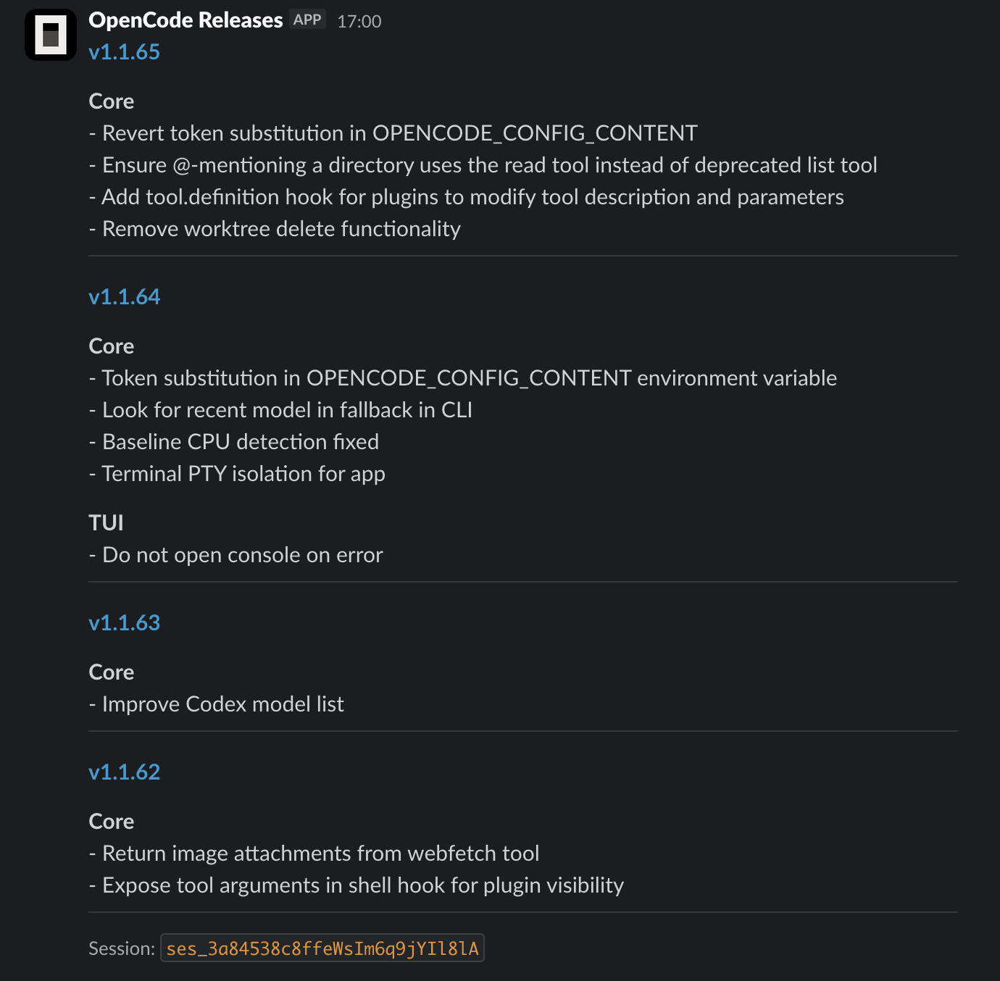

<h1 style="text-align:center;">Daily OpenCode release notes in Slack</h1>



## Why?

The opencode team ships too fast, I want to follow updates,
but at a regular pace, while drinking my morning tea. 🫖

## Pre-requisites

- OpenCode
- Bun
- `gh` CLI
- A Slack webhook URL

## Setup

Install dependencies:

```bash
bun install
```

Create a .env file:

```shell
# Don't forget the export keyword here:
export SLACK_WEBHOOK_URL=https://hooks.slack.com/services/...
```

To run as a one-off (for testing):

```bash
bun start
```

To run autonomously (every day at 06:00am):

```bash
bun launchd:install
bun launchd:load

# Reload (when making changes to the plist file):
bun launchd:install
bun launchd:reload

# Uninstall (turn off scheduling)
bun launchd:unload
```

## License

MIT - see [LICENSE](./LICENSE) for details

## Credits

Made with ❤️ by [François Best](https://github.com/franky47)
